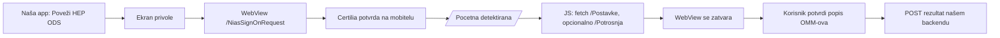

# Uvoz HEP ODS OMM-ova u naš sustav: preporuke

Cilj: korisnik se prijavi Certilijom i na najjednostavniji mogući način u naš
sustav prenese popis svojih obračunskih mjernih mjesta (OMM). Krajnja namjena je
procjena priključaka za fotonaponske elektrane.

Vezani dokumenti: [hep-moja-mreza-recept.md](hep-moja-mreza-recept.md) (rute,
selektori, format `POST /Omm/Dostava`).

## Što smo utvrdili 2026-10-01

- Moja mreža **ne pokazuje** postoji li na priključku elektrana, ni predaju u
  mrežu ni priključnu snagu. Za to treba drugi izvor (registri HEP ODS ili
  HROTE; nije provjereno što je javno).
- Vidljivi su samo OMM-ovi kojima je prijavljena osoba nositelj ugovora (veza
  preko OIB-a). Dodavanje tuđeg OMM-a nije moguće.
- Povijest potrošnje T1/T2 dostupna je ~3 godine unatrag. Za dimenzioniranje FN
  elektrane to je najkorisniji podatak na portalu.
- Javni obrasci na naslovnici imaju anti-spam/captcha i OIB, pa nisu put za
  masovno provjeravanje tuđih OMM-ova.

## Preporučeni pristup: mobilni WebView, parsiranje na uređaju

- Certilia mobile ID se ionako potvrđuje na mobitelu, pa je cijeli tok na jednom
  uređaju i bez instalacije ičega dodatnog.
- **Backend nikad ne dobiva HEP cookieje ni sesiju**, samo JSON s rezultatom.
- Uzimati minimum podataka: OMM, broj brojila, adresa, tarifni model. OIB ne
  uzimati ako nije potreban, iako je u istoj tablici.
- Stupce tražiti po nazivu iz `thead`, ne po indeksu. Selektore držati u udaljenoj
  konfiguraciji da se promjena HTML-a na HEP-u popravi bez nove verzije aplikacije.
- Javni API je `FlutterMojaMreza.uvezi(context)` → `HepUvoz` (napravljeno
  2026-10-05). Omotač u `lib/custom_code/actions` za FlutterFlow još ne postoji.
- Rezerva: ručni unos OMM-a (10 znamenki s računa) ili fotografija računa,
  označeno kao nepotvrđeno.
- Desktop: QR kod koji otvara mobilnu aplikaciju.

### Odbačeno

| Opcija | Zašto ne |
|---|---|
| Chrome extension za krajnje korisnike | instalacija je prevelika prepreka za jednokratnu radnju i budi nepovjerenje; ostaje opcija za interne korisnike i partnere (isti JS) |
| Bookmarklet / isječak za konzolu | previše tehnički za korisnike |
| Prijava na serveru (headless) | Certilia traži čovjeka, a držali bismo tuđu HEP sesiju |
| Javni obrasci bez prijave | captcha i OIB; zaobilaženje nije prihvatljivo |

## Otvoreno

1. **Certilia/NIAS u ugrađenom WebViewu**: na iOS-u radi (simulator i iPhone
   15 Pro, 2026-10-05; vidi
   [2026-10-05-uvoz-arhitektura-i-povjerenje.md](2026-10-05-uvoz-arhitektura-i-povjerenje.md)).
   **Android nije isproban.**
2. **Uvjeti korištenja**: pročitati
   `https://mojamreza.hep.hr/UserDocsImages/Izjava_o_nacinu_koristenja_aplikacije_Moja_mreza_2025.pdf`
   i provjeriti zabranjuje li automatizirani pristup.
3. Kako izgledaju `/Ocitanja` i `/Potrosnja` za **kupca s vlastitom proizvodnjom**
   (dodatni stupci za predaju?). Treba račun nekoga tko ima elektranu.
4. Rade li više OMM-ova i `?omm=` kako se očekuje; provjereno samo s jednim.
   Tuđi OMM u `?omm=` server tiho ignorira; uvoz to hvata usporedbom s
   `option[selected]`.
5. Izvor podataka o postojećim elektranama (HEP ODS, HROTE): nije istraženo.
   Službeni pristup mjernim podacima: HEP ODS nema OAuth ni API za treće strane
   (2026-10-05), samo ugovorni portal mjerenje.hep.hr i ovjerenu punomoć.
6. Oblik podataka i backend „našeg sustava“ još nisu definirani.
