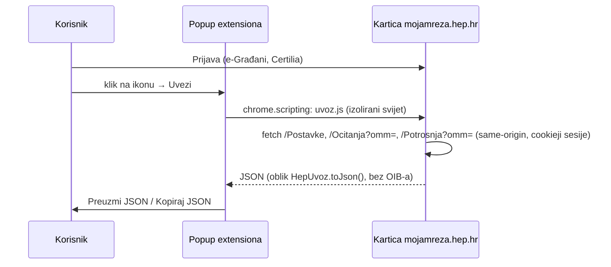

# Desktop: Chrome extension za uvoz

Isti uvoz kao `FlutterMojaMreza.uvezi()`, ali u pregledniku na računalu.
Kod je u `extension/`. Verzija 0.1 (stalna dozvola za portal) isprobana 2026-10-05 u Braveu (MV3, „Load unpacked“):
1 OMM, 46 očitanja, 23 razdoblja potrošnje, isto kao na Androidu.

## Zašto extension

| Opcija | Ocjena |
|---|---|
| **Chrome extension (MV3)** | izabrano: jedan klik na prijavljenoj kartici, `activeTab` bez stalnog pristupa ijednoj stranici, ništa ne napušta preglednik bez korisnika |
| Bookmarklet / isječak u konzoli | previše tehnički za korisnike; ostaje kao rezerva, `extension/uvoz.js` se može zalijepiti u konzolu i pozvati `await mojaMrezaUvoz()` |
| Userscript (Tampermonkey) | ionako treba instalirati dodatak, i to tuđi |
| Web app s extensionom kao mostom | sljedeći korak kad „naš sustav“ postoji: `externally_connectable` za našu domenu, extension vraća JSON stranici |
| File System Access | ne donosi ništa preko običnog preuzimanja |

Što točno čita, za korisnike: [kako-citamo-podatke.md](kako-citamo-podatke.md).

## Kako radi



- `uvoz.js` je prijepis `lib/src/parser.dart` (stupci po nazivu iz `thead`, prvi
  stupac retka `<th scope="row">`, provjera `?omm=` preko `option[selected]`).
  Promjena parsera mijenja se na oba mjesta.
- Datoteka je u IIFE-u jer se pri svakom kliku ponovno ubacuje u istu karticu
  (top-level `const`/`class` bi drugi put bacio grešku).
- Dozvole: `activeTab` i `scripting`, bez ijedne domene, pa instalacija nema
  upozorenje. Klik na ikonu daje pristup kliknutoj kartici dok se s nje ne ode.
  Zašto ne `optional_host_permissions`: vidi usporedbu u
  [2026-10-05-uvoz-arhitektura-i-povjerenje.md](2026-10-05-uvoz-arhitektura-i-povjerenje.md).
- Popup prvo pokaže ekran pristanka (što se čita, što ne). Na kartici koja nije
  `https://mojamreza.hep.hr/` nudi samo „Otvori mojamreza.hep.hr“ i ništa ne
  ubacuje.
- Popup mora ostati otvoren dok uvoz traje (par sekundi); ako se zatvori,
  rezultat se gubi i treba ponovno kliknuti.

## Razvoj

```bash
cd extension
npm install && npm test   # isti fixturei i provjere kao test/parser_test.dart (linkedom)
npm run zip               # build/moja-mreza-extension.zip za Chrome Web Store
```

Učitavanje: `brave://extensions` (ili `chrome://extensions`) → Developer mode →
Load unpacked → `extension/`. To ne može napraviti browser alat; radi korisnik.

## Otvoreno

- Nije objavljen u Chrome Web Storeu; nema ikona.
- Predaja „našem sustavu“ (`externally_connectable` ili POST) čeka backend.
- Rad s više OMM-ova neprovjeren, kao i na mobitelu.
