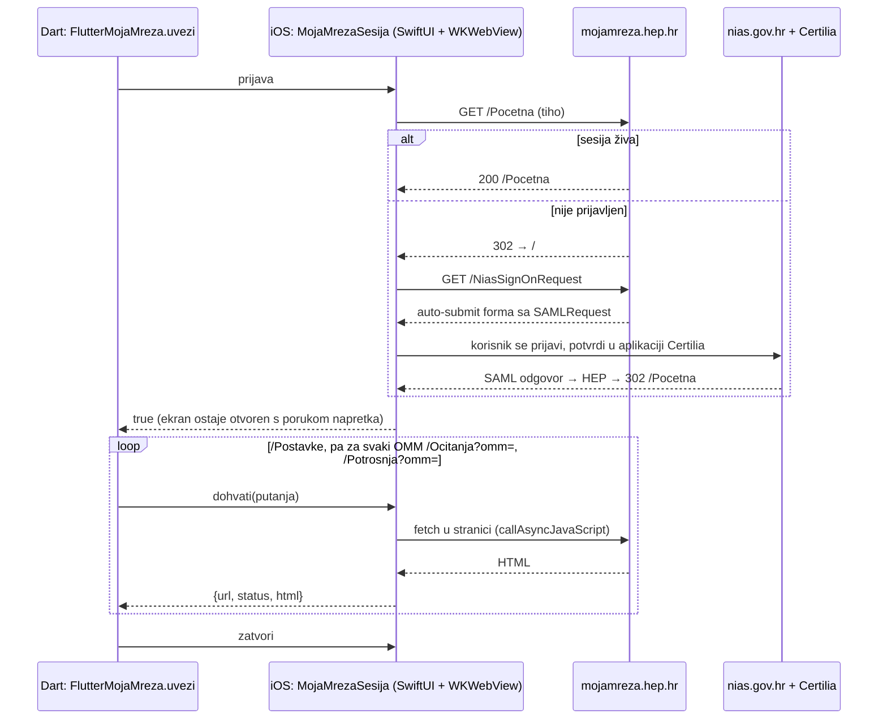

# Uvoz s Moje mreže: arhitektura i model povjerenja

Stanje 2026-10-05. Uvoz radi od početka do kraja: Certilia prijava u ugrađenom
WKWebViewu, zatim `/Postavke`, `/Ocitanja` i `/Potrosnja` za svaki OMM, s
parsiranjem na uređaju. Provjereno na iOS simulatoru (iPhone 17 Pro, iOS 26.3) i
na iPhoneu 15 Pro (iOS 26.6.2, instalacija preko linka). Za OMM 0100031779
uvezeno je svih 46 očitanja i 23 razdoblja potrošnje, koliko ih ima i portal.

Vezano: [hep-moja-mreza-recept.md](hep-moja-mreza-recept.md) (rute, HTML),
[2026-10-02-uvoz-omm-preporuke.md](2026-10-02-uvoz-omm-preporuke.md) (zašto WebView).

## Arhitektura

Platforma radi samo prijavu i `GET` unutar prijavljene sesije. Redoslijed
zahtjeva i parsiranje su u Dartu, pa su isti na svim platformama i testiraju se
fixtureima.

| Sloj | Datoteka |
|---|---|
| Javni API, redoslijed, provjere | `lib/flutter_moja_mreza.dart` |
| Ugovor transporta | `lib/flutter_moja_mreza_platform_interface.dart` |
| iOS, nativno | `ios/Classes/MojaMrezaSesija.swift`, `FlutterMojaMrezaPlugin.swift` |
| Android, nativno | `android/src/main/kotlin/com/example/flutter_moja_mreza/MojaMrezaSesija.kt`, `FlutterMojaMrezaPlugin.kt` |
| Parser i modeli | `lib/src/parser.dart`, `lib/src/modeli.dart` |

Provjere u `_stranica()`:

- konačni URL `/` znači da je sesija istekla (`sesijaIstekla`);
- za `?omm=` se `option[selected]` u `#omm_select` mora poklapati s traženim
  OMM-om, jer server tuđi OMM tiho ignorira i vrati stranicu odabranog;
- tablica bez očekivanih stupaca daje `neocekivanHtml`.

`/Postavke` nema `#omm_select`, pa se po njemu ne smije zaključivati je li
korisnik prijavljen (ta greška je nađena tek u simulatoru).

### Zašto nativni dio na iOS-u

Nativni dio nije brži od `webview_flutter`: vrijeme odlazi na prijavu i mrežu, a
`webview_flutter` na iOS-u je isti WKWebView. Dobiva se kontrola:

- `callAsyncJavaScript` čeka Promise, pa `fetch` vraća rezultat izravno;
- linkove koji nisu http(s) (otvaranje aplikacije Certilia) prosljeđuje sustavu;
- SwiftUI sloj s porukom napretka drži WebView u prozoru, pa ga iOS ne pauzira.

## Model povjerenja

Ništa od ovoga ne probija sigurnost preglednika. Aplikacija je *domaćin*
WebViewa i ima ovlasti koje obična web stranica nema:

| Mogućnost domaćina | Što bi aplikacija tehnički mogla |
|---|---|
| izvršiti JS u svakom originu, i na `nias.gov.hr` | čitati DOM i sve što korisnik upiše na stranicama prijave |
| čitati sve cookieje, i `HttpOnly` (`WKHTTPCookieStore`) | izvući HEP i NIAS sesiju i koristiti ih izvan uređaja |
| postaviti user agent (`applicationNameForUserAgent` s „Safari”) | sakriti pružatelju identiteta da je ugrađeni preglednik |
| crtati ekran bez adresne trake | korisnik ne vidi da je stranica zaista `nias.gov.hr` |

User agent je jedino stvarno zaobilaženje politike: neki pružatelji identiteta
odbijaju ugrađene preglednike upravo zbog ostalih redaka, a RFC 8252 za nativne
aplikacije traži vanjski preglednik.

Posljedica: **korisnik mora vjerovati aplikaciji** da radi samo ono što kaže.
Preciznije:

- **Certilia PIN aplikacija ne vidi.** Kod Certilia mobile.ID u WebView se upisuje
  samo korisničko ime; PIN ili biometrija potvrđuju se u aplikaciji Certilia. Ako
  korisnik na NIAS-u odabere vjerodajnicu koja se upisuje u stranicu (npr.
  jednokratnu lozinku banke), aplikacija bi je tehnički mogla pročitati.
- **Veći rizik je NIAS SSO sesija.** Dok traje, isti WebView bi vjerojatno mogao
  otvoriti i druge e-Građani usluge bez nove potvrde (nije provjereno). To je ono
  čemu korisnik zapravo vjeruje.
- Ni korisnik ni Apple ne mogu provjeriti ponašanje binarne datoteke.

### Smanjenje površine povjerenja (napravljeno 2026-10-05)

| Mjera | iOS | Android |
|---|---|---|
| Prolazna pohrana: NIAS sesija ne preživi uvoz. Cijena: prijava pri svakom uvozu. | `WKWebsiteDataStore.nonPersistent()`, novi WKWebView za svaku prijavu | zaseban WebView profil (`MULTI_PROFILE`), cookieji i storage obrisani u `zatvori()`; bez profila briše se globalni `CookieManager` |
| Glavni okvir samo na `mojamreza.hep.hr`, `nias.gov.hr`, `*.certilia.com`; ostalo u vanjski preglednik | `decidePolicyFor` | `shouldOverrideUrlLoading` (ne vidi POST, pa SAML forme ne prolaze kroz popis) |
| JS i kanal za rezultat samo na `https://mojamreza.hep.hr` | provjera URL-a prije `callAsyncJavaScript` | `addWebMessageListener` s origin pravilom; NIAS i Certilia ne vide kanal |
| `dohvati` prima samo relativnu putanju (`/…`, ne `//`) | da | da |

Certilia na NIAS-u ide preko `idp.certilia.com` (viđeno na Android emulatoru,
2026-10-05). Ako se pojavi druga domena, debug build je logira
(`MojaMreza navigacija <host>` u logcatu / konzoli) i otvara je vani.

Nije napravljeno: otvoreni kod plugina i jasna privola. To ne dokazuje što
binarna datoteka radi, ali pokazuje namjeru.

Ova pravila vežu samo pošten kod: korisnik i dalje vjeruje autoru aplikacije,
ali za manje stvari.

### Extension ili WebView: koji traži manje povjerenja

Procjena 2026-10-05. Na samoj Mojoj mreži su jednaki: oboje izvršava JS u
prijavljenoj sesiji i tehnički može sve što i korisnik (čitati OIB, poslati
očitanje, obrisati OMM). Razlika je u prijavi i u tome tko provodi granice.

| | WebView u aplikaciji | Chrome extension |
|---|---|---|
| Tko prikazuje prijavu | naša aplikacija, bez adresne trake | preglednik korisnika, s pravim URL-om i lokotom |
| Pristup `nias.gov.hr` i Certiliji | tehnički potpun (JS, unos, `HttpOnly` cookieji) | nikakav: `optional_host_permissions` je samo `mojamreza.hep.hr` |
| Tko jamči granice | mi; korisnik i trgovina ne mogu provjeriti binarnu datoteku | preglednik; dozvolu korisnik odobrava i vidi |
| Nova ovlast u novoj verziji | tiho, s ažuriranjem | nova domena gasi extension dok je korisnik ne odobri |
| Trajanje pristupa | samo tijekom uvoza (prolazna pohrana) | samo tijekom uvoza: dozvola se traži na klik i vraća na kraju (`chrome.permissions.remove`) |
| Čitljivost koda | binarna datoteka | običan JS u paketu |

Zaključak: kod extensiona korisnik vjeruje autoru samo za mojamreza.hep.hr, a
granicu provodi preglednik. Kod WebViewa vjeruje i za prijavu u državni
identitet, a granicu jamčimo samo mi. NIAS sesija vrijedi više od HEP-ove, pa je
extension na desktopu sigurniji izbor. RFC 8252 iz istog razloga traži vanjski
preglednik za prijavu u nativnim aplikacijama. Na mobitelu vanjski preglednik
(ASWebAuthenticationSession, Custom Tabs) ne daje aplikaciji pristup stranicama
nakon prijave, a HEP nema OAuth, pa WebView ostaje jedini put.

Sandbox preglednika (izolacija procesa, izolirani svijet content scripta) tu ne
pomaže: štiti od exploita i od same stranice, ne od autora extensiona unutar
njegovih dozvola. Pomaže model dozvola.

Javni opis onoga što kod čita: [kako-citamo-podatke.md](kako-citamo-podatke.md).

### Službeni put: nema ga

Pretraga 2026-10-05: HEP ODS nema OAuth ni javni API za treće strane.

- Portal [mjerenje.hep.hr](https://mjerenje.hep.hr/mjerenja/index.html) (krivulje
  opterećenja, 15-minutni podaci) je za korisnike s ugovorom. Pristup se traži
  [obrascem 1.1](https://www.hep.hr/ods/UserDocsImages/vazeci_obrasci/1.1_Zahtjev_pristup_mjernim_podacima.pdf).
  Zbog prelaska na novi poslovni informacijski sustav novi korisnici trenutno
  ne dobivaju pristup, a postojeći dobivaju ZIP.
- U Moju mrežu se tuđi OMM može dodati samo uz ovjerenu punomoć vlasnika
  ([HEP ODS: pristup mjernim podacima](https://www.hep.hr/ods/korisnici/poduzetnistvo/pristup-mjernim-podacima/44)).

Uvoz uz prijavu samog korisnika zato ostaje jedini praktičan put.

## Instalacija na iPhone preko linka (Tailscale)

`tools/ios_ota.sh` builda `.ipa` potpisan razvojnim profilom teama ITalk
(6SCK58757K, profil „*” već sadrži iPhone 15 Pro) i poslužuje ga na
`https://<mac>.ts.net/mojamreza/` samo unutar tailneta. Na iPhoneu se otvori u
Safariju i tapne „Instaliraj”.

- Xcode „Run” preko Tailscalea ne radi: Xcode traži uređaj Bonjourom, koji
  Tailscale ne prenosi, pa je iPhone izvan kućne mreže „unavailable”.
- `itms-services` traži HTTPS s valjanim certifikatom; daje ga `*.ts.net`
  (Serve mora biti uključen na tailnetu, uključeno 2026-10-05).
- Tailscale iz App Storea na macOS-u ne smije posluživati direktorij (sandbox),
  pa direktorij poslužuje `python3 -m http.server` na `127.0.0.1`, a
  `tailscale serve` radi proxy. Port 8765 na Macu zauzima drugi servis; skripta
  koristi 18765 i provjerava je li slobodan.

## Testiranje iz simulatora preko RustDeska

RustDesk s iPhonea na Mac ne prenosi tipke u Simulator. Pomaže tipkovnica na
ekranu: `defaults write com.apple.iphonesimulator ConnectHardwareKeyboard -bool false`
i ponovno pokretanje Simulatora. Zatvaranje Simulatora prekida `flutter run`.
Hot reload bez stdin-a: `kill -USR1 <pid flutter_tools run>`.

## Android: zamke

- Example je generiran starijim Flutterom; Flutter 3.47 traži Gradle ≥ 8.14 i
  Kotlin ≥ 2.2.20 (podignuto na 8.14.3 / AGP 8.11.1 / 2.2.20, AGP ostaje < 9).
- `evaluateJavascript` ne čeka Promise, pa `fetch` rezultat vraća kroz
  `addWebMessageListener` (treba `androidx.webkit`, WebView ≥ 82; inače
  `nepodrzano`).
- Ekran je `Dialog` preko Flutter Activityja (nema Activityja u manifestu).
  Natrag tijekom prijave ide korak natrag u WebViewu, inače je odustajanje.
- Provjereno na emulatoru `podcasterium_shots` (WebView 124), 2026-10-05:
  Certilia prijava s potvrdom na mobitelu, uvoz OMM 0100031779 s 46 očitanja
  i 23 razdoblja potrošnje, isto kao iOS.
- `certilia://confirmUserOnMobileID?uuid=…` se na emulatoru ne može otvoriti
  (nema aplikacije); greška se samo logira, a prijava prolazi potvrdom na
  drugom uređaju.
- Logcat reže dugi `debugPrint` JSON; za provjeru broji retke u sirovom HTML-u
  (`adb shell run-as com.example.flutter_moja_mreza_example cat code_cache/moja_mreza_html/…`).
