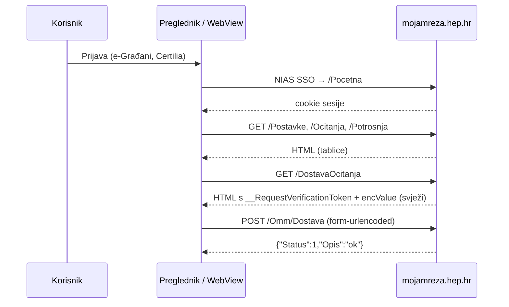

# Moja mreža (HEP ODS): programski pristup

Recept kako čitati podatke i dostaviti očitanje na `https://mojamreza.hep.hr` bez
klikanja po sučelju. Snimljeno 2026-10-01 iz prijavljene sesije (Brave,
claude-in-chrome), uz stvarnu dostavu očitanja koja je prošla.

## Ukratko

- Aplikacija je **server-rendered ASP.NET MVC** (jQuery, jQuery Validate). Nema
  JSON API-ja za čitanje: podaci se čitaju parsiranjem HTML tablica.
- Jedini JSON endpoint koji koristimo je **`POST /Omm/Dostava`** (dostava očitanja).
  To je običan `application/x-www-form-urlencoded` POST forme, poslan AJAX-om.
- Autentikacija je **cookie sesije**. Prijava ide preko e-Građana (NIAS,
  Certilia mobile ID) i ne može se automatizirati: čovjek se mora prijaviti.
  Nakon toga svaki `fetch` iz istog preglednika (ili zahtjev s istim cookiejima)
  radi.
- Vidljivi su samo OMM-ovi za koje je prijavljena osoba nositelj ugovora
  (veza preko OIB-a). Tuđi OMM se ne može dodati.
- Nema podataka o priključku ni proizvodnji (FN elektrana, predaja u mrežu,
  priključna snaga). Za OMM bez elektrane to se ne može provjeriti; za kupca s
  vlastitom proizvodnjom tablice možda imaju dodatne stupce.



## Stranice za čitanje (GET, nakon prijave)

| Ruta | Što sadrži | Kako parsirati |
|---|---|---|
| `/Postavke` | OMM, broj brojila, korisnik, OIB, adresa, tarifni model | `table` s `thead th` = `OMM, Broj brojila, Korisnik, OIB, Adresa OMM, Tarifni model, Izbriši` |
| `/Ocitanja` | sva stanja brojila T1/T2 od ugovora | `table tbody tr`; ćelije su `Datum, Opis, Tarifa 1, Tarifa 2` (stupac „Status“ je samo ikona, nema teksta) |
| `/Potrosnja` | potrošnja po obračunskim razdobljima | `table tbody tr`; `Razdoblje ("dd.mm.yyyy. - dd.mm.yyyy."), Tarifa 1, Tarifa 2` |
| `/DostavaOcitanja` | očekivani raspon idućeg očitanja, datum idućeg obračuna, tokeni za POST | `#dostavaOcitanjaForm` |
| `/Pocetna` | zadnjih 10 razdoblja potrošnje + polugodišnji zbroj | polugodišnji zbroj puni se AJAX-om na promjenu `#Razdoblje` (vrijednosti `7`, `6`, `5`…), tekst `"<razdoblje> - Ukupno <kWh>"` |
| `/PotrosnjaPDF?razdoblje=N` | PDF obavijest o potrošnji | binarni PDF |

Izbor OMM-a: na svakoj stranici je `select#omm_select` (`name="omm"`) unutar
GET forme, pa se drugi OMM bira s `?omm=<broj>`. Provjereno samo s jednim OMM-om.

Datumi su u formatu `dd.mm.yyyy.` (s točkom na kraju), brojevi su cijeli kWh.

## Dostava očitanja: `POST /Omm/Dostava`

### 1. Uzmi svježe tokene

`GET /DostavaOcitanja` i iz `#dostavaOcitanjaForm` pročitaj skrivena polja.
**Oba tokena se mijenjaju pri svakom učitavanju stranice**, pa ih se ne smije
spremati i ponovno koristiti.

| Polje | Primjer | Napomena |
|---|---|---|
| `__RequestVerificationToken` | 108 znakova | ASP.NET anti-forgery token; uparen je s istoimenim cookiejem |
| `encValue` | 984 znaka, base64 | neproziran serverski nonce, mijenja se po učitavanju |
| `DostavaVM.Posalji` | `0` | `1` samo kod ponovnog slanja nakon upozorenja (vidi dolje) |
| `DostavaVM.Omm` | `0100031779` | 10 znamenki, s vodećom nulom |
| `DostavaVM.Datum_Ocitanja` | `01.10.2026.` | polje je readonly i uvijek je **današnji** datum; sat se ne šalje |

### 2. Pošalji

```
POST https://mojamreza.hep.hr/Omm/Dostava
Content-Type: application/x-www-form-urlencoded; charset=UTF-8
X-Requested-With: XMLHttpRequest
Cookie: <cookieji sesije>

__RequestVerificationToken=<…>&encValue=<…>&DostavaVM.Posalji=0
&DostavaVM.Omm=0100031779&DostavaVM.Datum_Ocitanja=01.10.2026.
&DostavaVM.Tarifa1=15283&DostavaVM.Tarifa2=8993
```

Redoslijed polja je onaj iz `$form.serialize()`. `X-Requested-With` dodaje
jQuery; nije provjereno odbija li server zahtjev bez njega.

### 3. Odgovor

| Odgovor | Značenje | Što napraviti |
|---|---|---|
| `{"Status":1,"Opis":"ok"}` | prihvaćeno (provjereno) | ništa |
| `{"Status":…,"Opis":"…","Posalji":…}` | upozorenje, npr. vrijednost izvan očekivanog raspona | po želji ponovi POST s `DostavaVM.Posalji=1` (u sučelju je to gumb „Dostavi svejedno“) |
| `{"Status":…,"Opis":"…"}` bez `Posalji` | greška | prikaži `Opis` |

Grane upozorenja i greške pročitane su iz JS handlera stranice, nisu
isprobane. Očekivani raspon se vidi na `/DostavaOcitanja` ispod polja
(„očekivani raspon od X do Y“): donja granica je zadnje stanje, pa veće
odstupanje vjerojatno izaziva upozorenje.

Tarifa 2 je obavezna samo ako brojilo ima više tarifa (u JS-u
`provjeraOcitanjaResponse.Br_Tarifa > 1`).

## Isprobani isječak (konzola prijavljene stranice, WebView ili extension)

Radi u kontekstu `https://mojamreza.hep.hr` jer koristi cookieje preglednika.
Isti kod se može ubaciti u Flutter WebView (`runJavaScriptReturningResult`) ili u
content script Chrome extensiona.

```js
const clean = s => (s || '').replace(/\s+/g, ' ').trim();
const page = async p => new DOMParser().parseFromString(await (await fetch(p)).text(), 'text/html');
const rows = d => [...d.querySelectorAll('table tbody tr')]
  .map(tr => [...tr.querySelectorAll('td')].map(td => clean(td.textContent)))
  .filter(r => r.some(Boolean));

// Čitanje
async function mojaMrezaDump() {
  return {
    postavke: rows(await page('/Postavke')),
    ocitanja: rows(await page('/Ocitanja')),     // [datum, opis, t1, t2]
    potrosnja: rows(await page('/Potrosnja')),   // [razdoblje, t1, t2]
  };
}

// Dostava očitanja. posalji=1 samo za "Dostavi svejedno".
async function mojaMrezaDostava(t1, t2, posalji = 0) {
  const d = await page('/DostavaOcitanja');
  const form = d.querySelector('#dostavaOcitanjaForm');
  const body = new URLSearchParams(new FormData(form));
  body.set('DostavaVM.Posalji', String(posalji));
  body.set('DostavaVM.Tarifa1', String(t1));
  body.set('DostavaVM.Tarifa2', String(t2));
  const r = await fetch(form.getAttribute('action'), {
    method: 'POST',
    headers: { 'X-Requested-With': 'XMLHttpRequest' },
    body,
  });
  return r.json(); // {"Status":1,"Opis":"ok"} = uspjeh
}
```

Čitanje (`mojaMrezaDump`) odgovara onome što je isprobano 2026-10-01. Dostava je
tog dana poslana klikom na gumb u sučelju i zahtjev je uhvaćen. `mojaMrezaDostava`
je složena prema tom zahtjevu, ali sama još nije pokrenuta.
`new FormData(form)` na parsiranom dokumentu daje sva polja, uključujući
readonly `Datum_Ocitanja`.

## Bez preglednika (curl, Python…)

Treba samo kopirati cookieje sesije iz preglednika (DevTools → Network →
bilo koji zahtjev na `mojamreza.hep.hr` → zaglavlje `Cookie`) i ponoviti iste
korake: GET `/DostavaOcitanja` → izvuci tokene → POST `/Omm/Dostava`.
**Anti-forgery cookie i token iz forme moraju doći iz iste sesije**, pa sve
zahtjeve šalji s istim cookiejima. Nazivi cookieja nisu zapisani (alat za
preglednik blokira čitanje `document.cookie`). Koliko dugo sesija traje nije
provjereno.

Prema FAQ-u (`/MojaMreza?faqid=5`), za čitanje i dostavu očitanja dovoljna je
i prijava korisničkim imenom i lozinkom. Takav račun otvara korisnička podrška,
a predaja zahtjeva traži prijavu preko e-Građana.

## Javni obrasci na naslovnici (bez prijave)

Naslovnica ima „Dostava očitanja“ i „Provjera potrošnje za razdoblje“ po OMM-u
bez prijave. Oba obrasca imaju anti-spam provjeru (`antiSpamVM`,
`checkIfCaptchaIsValid`), a provjera potrošnje ima i polje za OIB. Nisu
predviđeni za automatizaciju i ne koristimo ih.
