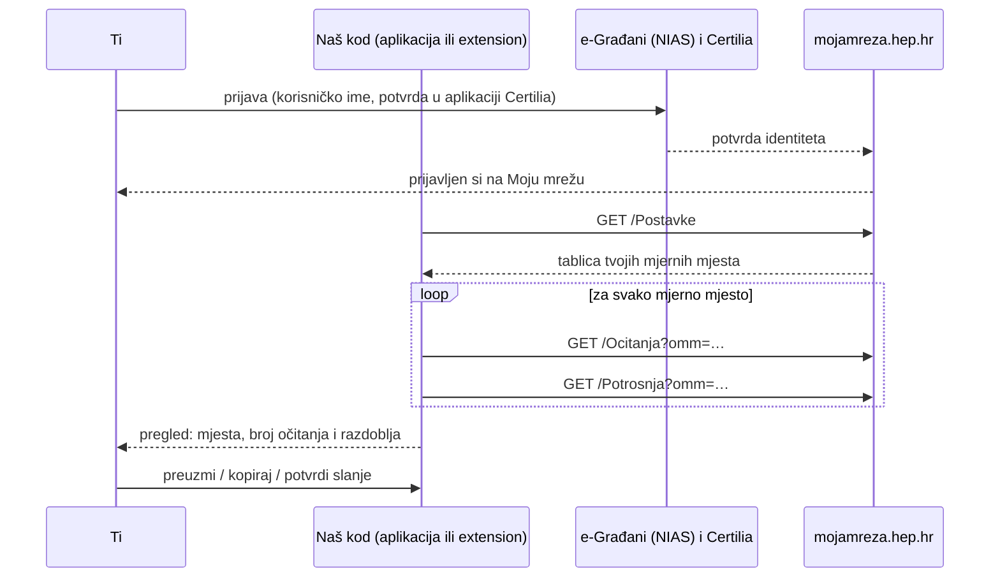

# Kako čitamo tvoje podatke s Moje mreže

Ovaj dokument točno opisuje što naš kod radi nakon što se prijaviš na
[Moju mrežu](https://mojamreza.hep.hr) (HEP ODS) preko e-Građana. Cilj je da
podatke o potrošnji ne moraš prepisivati s portala, a da pritom znaš što se
čita i gdje završava. Svaka tvrdnja ispod ima poveznicu na kod koji je provodi.

Stanje: 2026-10-05. Vrijedi za mobilnu aplikaciju (iOS, Android) i za Chrome
extension.

## Ukratko

- **Prijavljuješ se sam**, na službenoj stranici e-Građana (NIAS) i Certilijom.
  Lozinku ni PIN ne upisuješ u naš kod.
- **Samo čitamo.** Šaljemo isključivo `GET` zahtjeve na pet stranica Moje mreže.
  Ne šaljemo očitanje, ne mijenjamo postavke, ne brišemo mjerna mjesta.
- **OIB ne uzimamo**, iako je u istoj tablici kao broj mjernog mjesta.
- **Podaci ostaju kod tebe** dok ih sam ne preuzmeš, kopiraš ili potvrdiš slanje.
- **Sesija se ne čuva.** Na mobitelu se briše nakon uvoza, pa sljedeći uvoz
  traži novu prijavu. U pregledniku extension nema stalni pristup ni jednoj
  stranici; dobiva ga samo kad klikneš njegovu ikonu, i samo za tu karticu.

## Tok



## Koje stranice čitamo

Sve su na `https://mojamreza.hep.hr`, uvijek metodom `GET`, iz tvoje prijavljene
sesije. To su iste stranice koje vidiš kad klikaš po portalu.

| Stranica | Zašto | Što uzimamo |
|---|---|---|
| `/NiasSignOnRequest` | otvara prijavu e-Građana (samo mobitel) | ništa, preusmjerava na NIAS |
| `/Pocetna` | prepoznaje da je prijava gotova (samo mobitel) | ništa |
| `/Postavke` | popis tvojih mjernih mjesta | broj OMM-a, broj brojila, ime korisnika, adresa, tarifni model. **OIB ne.** |
| `/Ocitanja?omm=…` | stanja brojila | datum, opis (npr. „Očitanje kupca“), stanje T1 i T2 u kWh |
| `/Potrosnja?omm=…` | potrošnja po obračunskim razdobljima | od, do, T1 i T2 u kWh |
| `/Odjava` | odjava sa servera (samo mobitel, kad prekineš) | ništa |

Kod koji šalje zahtjeve:

- redoslijed i provjere: [`lib/flutter_moja_mreza.dart`](../lib/flutter_moja_mreza.dart)
  (mobitel), [`extension/uvoz.js`](../extension/uvoz.js) (preglednik);
- izdvajanje polja iz tablica: [`lib/src/parser.dart`](../lib/src/parser.dart),
  isto u `extension/uvoz.js`;
- `fetch` u stranici: [`ios/Classes/MojaMrezaSesija.swift`](../ios/Classes/MojaMrezaSesija.swift)
  i [`android/.../MojaMrezaSesija.kt`](../android/src/main/kotlin/com/example/flutter_moja_mreza/MojaMrezaSesija.kt)
  (funkcija `dohvati`). Prima samo putanju na istom serveru (`/…`), nikad drugi
  host, i nema parametar za metodu, pa ne može poslati `POST`.

## Što ne radimo

- Ne šaljemo očitanje brojila (`/Omm/Dostava`), iako portal to omogućuje.
- Ne diramo `/Postavke` osim čitanja (gumb „Izbriši“ nikad se ne poziva).
- Ne otvaramo druge usluge e-Građana (ePorezna i sl.), iako je prijava ista.
- Ne čitamo i ne spremamo cookieje ni sesiju. HEP ni NIAS sesija ne napuštaju
  tvoj uređaj.
- Ne izvršavamo kod na stranicama prijave (`nias.gov.hr`, `certilia.com`).
- Ne šaljemo ništa trećima: kod uvoza nema analitiku ni praćenje.

## Što dobiješ

JSON istog oblika na svim platformama
([`HepUvoz.toJson()`](../lib/src/modeli.dart)):

```json
{
  "izvor": "https://mojamreza.hep.hr",
  "dohvaceno": "2026-10-05T16:17:34.447Z",
  "mjesta": [
    {
      "omm": "0100031779",
      "broj_brojila": "87071794",
      "korisnik": "PERO PERIĆ",
      "adresa": "ULICA 1, MJESTO",
      "tarifni_model": "Kućanstvo NN Bijeli Mjesečno",
      "ocitanja": [
        { "datum": "2026-10-05", "opis": "Očitanje kupca", "t1_kwh": 15343, "t2_kwh": 9019 }
      ],
      "potrosnja": [
        { "od": "2026-09-01", "do": "2026-09-30", "t1_kwh": 299, "t2_kwh": 128, "ukupno_kwh": 427 }
      ]
    }
  ]
}
```

(Primjer je anonimiziran.)

## Kako se to provodi na kojoj platformi

### Chrome extension

- Dozvole su `activeTab` i `scripting`. **Extension nema stalni pristup ni
  jednoj stranici**, pa preglednik pri instalaciji ne prikazuje upozorenje.
- Pristup dobiva tek kad klikneš njegovu ikonu (`activeTab`): samo za tu
  karticu i samo dok s te stranice ne odeš. Bez klika ne može ništa, ni u
  pozadini ni u drugim karticama. To provodi preglednik.
- Prozorčić prvo pokaže što će pročitati, a što ne. Uvoz kreće tek na gumb
  „Dopusti čitanje i uvezi“, i samo ako je kartica `https://mojamreza.hep.hr`.
  Ovu provjeru radi naš kod ([`extension/popup.js`](../extension/popup.js)),
  ne preglednik.
- Prijava ide u tvom pregledniku, s pravom adresnom trakom. Na stranicama
  prijave e-Građana extension nema pristup, osim ako na njima sam klikneš
  njegovu ikonu.
- Kod je običan JavaScript, nije minificiran ni zamagljen, pa se može pročitati
  u instaliranom paketu ili ovdje u repou.

### Mobilna aplikacija (iOS, Android)

- Prijava ide u ugrađenom pregledniku (WebView) unutar aplikacije.
- Pohrana tog preglednika je privremena i briše se na kraju uvoza.
- Glavni prozor smije samo na `mojamreza.hep.hr`, `nias.gov.hr` i
  `*.certilia.com`. Ostale adrese otvaraju se u sustavskom pregledniku.
- Kod se izvršava samo na `https://mojamreza.hep.hr`.

Pojedinosti: [2026-10-05-uvoz-arhitektura-i-povjerenje.md](2026-10-05-uvoz-arhitektura-i-povjerenje.md).

## Čemu ipak vjeruješ

Iskreno, jer bez toga ostatak ne vrijedi:

- **Na Mojoj mreži** svaki kod koji radi u tvojoj prijavljenoj sesiji tehnički
  može sve što možeš i ti, uključujući slanje očitanja. Ovdje opisano
  ograničenje na čitanje je naša odluka u kodu. Nije pravilo preglednika ni
  HEP-a.
- **Na mobitelu** aplikacija koja prikazuje ugrađeni preglednik tehnički može
  vidjeti i stranice prijave e-Građana. Mjere iznad to sprječavaju u našem kodu,
  ali ih izvana ne možeš provjeriti kao što možeš kod extensiona. Ako ti je to
  važno, koristi extension na računalu.
- **U pregledniku** preglednik provodi da extension ne može ništa bez tvog
  klika i izvan kartice na kojoj si kliknuo. Da se uvoz pokreće samo na
  `mojamreza.hep.hr` i samo čita, provodi naš kod. Ne klikaj ikonu na
  stranicama na kojima je ne trebaš.

Sve što se čita s portala je ovdje navedeno. Ako primijetiš zahtjev koji nije
na popisu (DevTools → Network u pregledniku), to je greška i javi nam.
